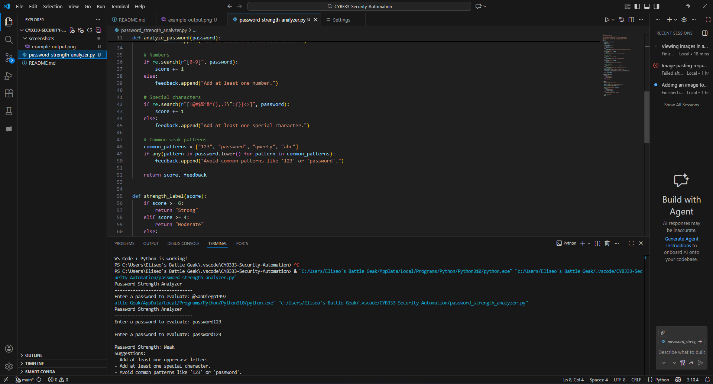

# CYB333-Security-Automation
NU CYB333 class project and excersices
# Password Strength Analyzer

## Overview
This project is a Python-based password strength analyzer for the CYB333 Security Automation course. It evaluates passwords based on length, character variety, and common weak patterns, then gives suggestions to improve them.

## Features
- Checks password length
- Evaluates uppercase, lowercase, numbers, and symbols
- Detects common weak patterns (ex: "123", "password")
- Outputs a strength rating (Weak / Moderate / Strong)
- Provides improvement suggestions

## Requirements
- Python 3.x

## How to Run
1. Open the project folder in VS Code
2. Open a terminal
3. Run:
   ```bash
   python password_strength_analyzer.py

## Example Output


